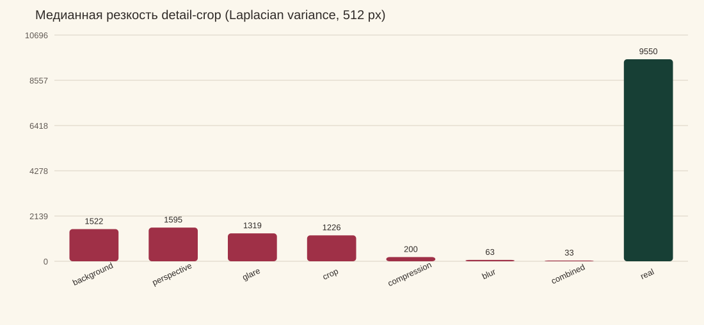

# Синтетика Stage 2 против 66 полевых фотографий

Дата анализа: 21 сентября 2026 года.

## Короткий вывод

**Blur не испортил веса DINOv2:** модель не дообучалась на синтетике. В индекс
помещены чистые изображения каталога из `data/parser`, а все 2025 синтетических
кадров имеют split `validation`. Поэтому синтетика могла повлиять только на
выбор варианта модели/предобработки, веса гибридного ранжирования и калибровку
confidence.

При этом подозрение насчёт слишком жёстких и не вполне реалистичных искажений
верное. Медианная резкость центрального detail-crop реальных кадров равна
**9550,0**, профиля `blur` — **63,3** (150,91× ниже
реальных), а `combined` — **32,6** (293,00× ниже
реальных). `combined` одновременно складывает blur, уменьшение, JPEG,
перспективу и иногда glare/occlusion, поэтому его следует считать стресс-тестом,
а не представителем обычной фотографии из магазина.

## Что именно генерировалось

- исходные карточки сами невелики: медиана — **154×540 px**;
- медиана alpha-bbox бутылки — **143×540 px**;
- в синтетическом кадре бутылка имеет эффективную ширину примерно
  **116,0 px** в обычных профилях;
- `compression` дополнительно уменьшает весь кадр до
  **38–65%**,
  а `combined` — до **48–78%**;
- Gaussian blur использует sigma **1,10–2,40**,
  motion blur — ядро **5–13 px**;
- после этого `combined` сохраняется с JPEG quality 42–67.

То есть при медианной ширине бутылки около 100 px режим `combined` временно
сжимает её примерно до 50–80 px. Этикетка занимает лишь часть этой ширины —
для мелких букв это уже физическая потеря информации, которую последующий
upscale не возвращает.

## Синтетические профили и качество DINOv2-small

| Профиль       |    N | Резкость detail, median | Эффективная ширина бутылки, px | Top-1 | Top-5 |
| ------------- | ---: | ----------------------: | -----------------------------: | ----: | ----: |
| `background`  |  290 |                  1522,0 |                          116,0 | 80,3% | 99,3% |
| `perspective` |  290 |                  1595,1 |                          119,0 | 82,8% | 99,0% |
| `glare`       |  289 |                  1319,4 |                          117,0 | 77,9% | 99,3% |
| `crop`        |  289 |                  1226,1 |                          158,0 | 83,4% | 99,3% |
| `compression` |  289 |                   200,2 |                           61,2 | 73,0% | 97,6% |
| `blur`        |  289 |                    63,3 |                          115,0 | 64,0% | 87,5% |
| `combined`    |  289 |                    32,6 |                           88,7 | 38,1% | 64,7% |

Падение качества согласуется с разрушением деталей: `compression` хуже чистого
background на 7,3 п.п.
Top-1, `blur` — на 16,3 п.п.,
а `combined` — на 42,3 п.п.
Это показывает чувствительность текущего visual retrieval к потере деталей, но
не доказывает, что эти преобразования ухудшили саму модель: её веса неизменны.

Внутри самого профиля `blur` motion blur действительно вреднее Gaussian:

| Подтип синтетики    |    N | Top-1 | Top-5 |
| ------------------- | ---: | ----: | ----: |
| Gaussian blur       |  139 | 71,2% | 94,2% |
| Motion blur         |  150 | 57,3% | 81,3% |
| Combined + Gaussian |   88 | 53,4% | 75,0% |
| Combined + motion   |  201 | 31,3% | 60,2% |

## Реальные 66 кадров

Метрики считаются после приведения длинной стороны к 512 px. `detail` — тот же
центральный crop 22–78% по ширине и 30–91% по высоте, который используется в
multiscale DINO-запросе. Variance of Laplacian — относительная мера резкости:
сравнивать её следует только при одинаковом размере предобработки.

| Группа         |    N | MP, median | Резкость detail, median | Контраст | Энтропия |
| -------------- | ---: | ---------: | ----------------------: | -------: | -------: |
| Все реальные   |   66 |      12,19 |                  9550,0 |     65,7 |     7,44 |
| Top-1          |   34 |      12,19 |                  8181,2 |     65,7 |     7,48 |
| Только Top-2–5 |   18 |      12,19 |                  9314,2 |     69,6 |     7,42 |
| Промах Top-5   |   14 |      12,19 |                 12073,8 |     58,4 |     7,37 |

### Связь резкости с результатом

| Треть выборки по резкости |    N |        Диапазон | Top-1 | Top-5 |
| ------------------------- | ---: | --------------: | ----: | ----: |
| `low`                     |   22 |    966,0–7271,9 | 63,6% | 90,9% |
| `middle`                  |   22 |  7385,4–12058,3 | 50,0% | 77,3% |
| `high`                    |   22 | 12089,3–25289,5 | 40,9% | 68,2% |

Резкость сама по себе не объясняет основную часть ошибок. В промахах Top-5
есть отсутствующие в локальном индексе классы Литавщука: ни DINO, ни любая
аугментация не могут выбрать класс, которого нет среди кандидатов. А большая
часть ошибок Top-1 происходит внутри одного производителя между похожими
этикетками — здесь важнее OCR-reranker по названию/сорту/году и более свежие
референсы.

## Контрольный эксперимент на одних и тех же реальных фото

Чтобы не путать различие содержимого двух датасетов с действием фильтра, отдельно
взяты 52 реальных кадра с известным точным slug. К каждому применено одно
искажение после уменьшения длинной стороны до 512 px, затем выполнен чистый
DINOv2-small CLS multiscale retrieval по тому же индексу. OCR, SIFT и
manufacturer gate здесь намеренно выключены.

| Вариант реального кадра              |    DINO Top-1 |    DINO Top-5 | Δ Top-1 | Δ Top-5 |
| ------------------------------------ | ------------: | ------------: | ------: | ------: |
| Без дополнительного искажения        | 14/52 (26,9%) | 20/52 (38,5%) |      +0 |      +0 |
| Gaussian sigma 1,7                   | 13/52 (25,0%) | 24/52 (46,2%) |      -1 |      +4 |
| Motion blur 9 px                     |  8/52 (15,4%) | 25/52 (48,1%) |      -6 |      +5 |
| Downscale 0,526 + JPEG 44            | 11/52 (21,2%) | 25/52 (48,1%) |      -3 |      +5 |
| Motion 9 + downscale 0,618 + JPEG 55 | 12/52 (23,1%) | 24/52 (46,2%) |      -2 |      +4 |

Главный вредитель именно **motion blur**: он убрал 6 правильных Top-1 net
(14 → 8). Gaussian sigma 1,7 изменил Top-1 всего на −1. Downscale+JPEG дал −3.
При этом Top-5 у искажённых вариантов неожиданно вырос: слабое размытие иногда
подавляет фон магазина и приближает фото к гладким каталожным референсам. Это
не делает blur полезной аугментацией для обучения — результат показывает, что
чистый DINO нестабилен и при небольшом фильтре просто переставляет соседей.

Абсолютный DINO-only результат на реальных фото низкий: 14/52 Top-1 и 20/52
Top-5 до искажений. Текущие 34/52 и 52/52 на кадрах с известным slug получаются
уже за счёт OCR, SIFT и manufacturer gate. Следовательно, исправлять только
синтетический blur недостаточно.

## Что в текущей синтетике полезно, а что стоит изменить

1. **Не удалять blur полностью.** Он нужен как отдельный robustness-тест и
   действительно выявляет слабость visual retrieval.
2. **Разделить validation и stress.** `background`, mild perspective/crop/glare
   оставить в реалистичной validation; нынешние `blur` и особенно `combined`
   вынести в отдельный stress split, который не определяет выбор confidence
   threshold.
3. **Подогнать параметры по полевым кадрам.** Для основной validation брать
   эмпирические диапазоны резкости/контраста/JPEG из этих 66 кадров; тяжёлый
   хвост оставить отдельно. Не складывать все тяжёлые искажения в каждом
   `combined`-кадре.
4. **Если начнём дообучение**, генерировать несколько реалистичных вариантов на
   продукт и держать split по slug/продукту. Сейчас один синтетический кадр на
   slug — это слишком мало для обучения и одновременно слишком случайно для
   надёжной оценки каждого класса.
5. **Калибровать confidence на реальных фото.** Именно здесь синтетический
   domain gap уже доказан: confidence-модель обучалась преимущественно на
   синтетических known/unknown кадрах и почти все полевые фото объявляет
   `not_found`, хотя правильный вариант часто находится в Top-5.

## Ограничения анализа

- 66 кадров — небольшая и несбалансированная выборка по производителям;
- резкость измеряет весь центральный crop, а не только пиксели этикетки: без
  детектора бутылки фон тоже влияет на показатель;
- группа `miss` смешивает визуальные ошибки и отсутствующие классы, поэтому её
  нельзя использовать как чистую оценку влияния blur;
- сравнение файлового размера JPEG и WebP не использовалось как мера качества,
  поскольку кодеки разные.

Машиночитаемые результаты находятся рядом: `summary.json` и
`image_metrics.csv`.
